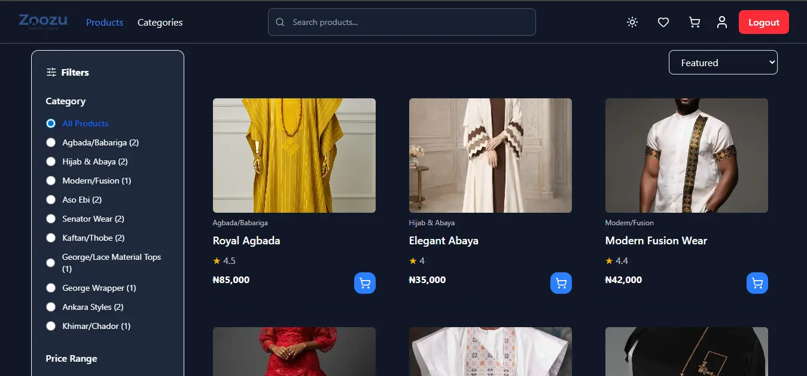
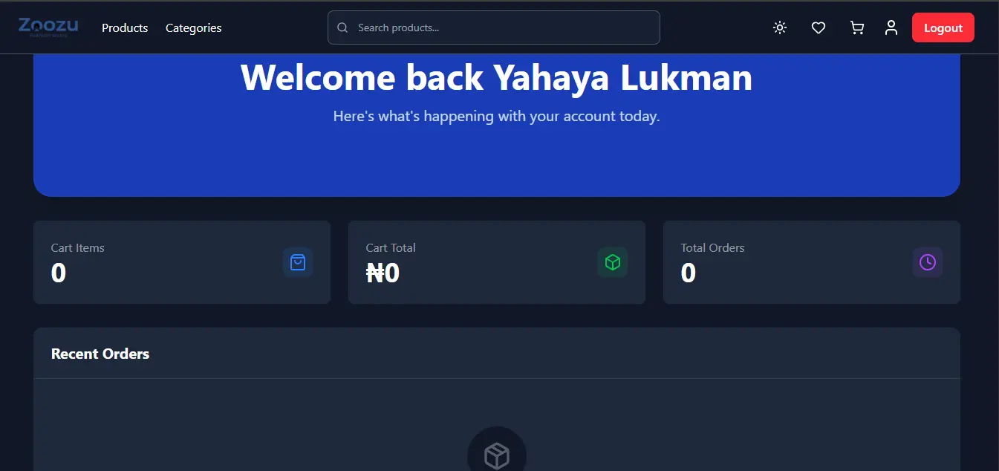
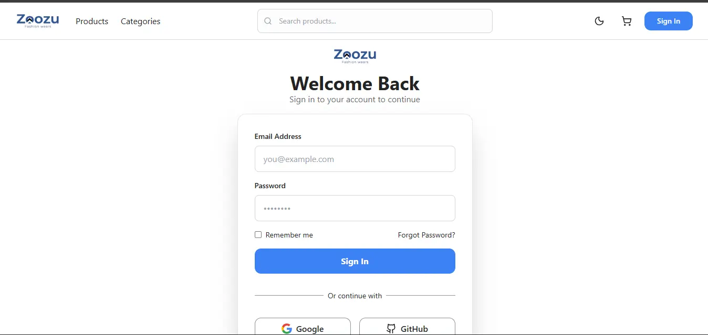
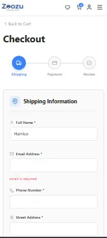
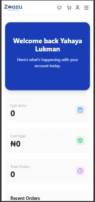

# Zoozu Collections

A full-featured frontend e-commerce application for Nigerian traditional and contemporary fashion. Browse, filter, and purchase authentic styles including Agbada, Ankara, Aso Ebi, Kaftan, Senator Wear, and more.

> **Built as a frontend portfolio project** — all data is stored in `localStorage`. No backend or real payment processing is connected.

---

## Live Demo

> Deploy to Vercel : zoozu-collections.vercel.app

---

## Screenshots

### Landing page

> 

### Product page

> 

### Dashboard page

> 

### Register page

> 

### Mobile View & Checkout

<p align="center">
  
  
</p>

---

## Features

### Shopping Experience

- Product catalogue with **16 products** across 9 Nigerian fashion categories
- **Filter** by category and price range
- **Sort** by featured, price (low/high), and highest rated
- **Pagination** — 8 products per page
- **Live search** with debounced dropdown showing instant results as you type
- Product detail page with image, rating, description, quantity selector, and related products
- **Wishlist** — save items you love, view and manage from a dedicated page

### Cart & Checkout

- Persistent shopping cart (per user, survives page refresh)
- Cart drawer with quantity controls
- Full-page cart view
- **3-step checkout**: Shipping → Payment → Review
- Shipping form auto-filled with logged-in user's name and email
- Card number formatted in groups of 4 digits as you type
- **Luhn algorithm** validation on card numbers (catches typos)
- Auto-focus from card number → expiry date → CVV
- Expiry date auto-formatted to MM/YY
- PayPal and Apple Pay show "unavailable" notice with redirect to card
- **Order confirmation page** with full order summary after placing an order

### User Accounts

- Register and login — email uniqueness enforced on registration
- All user data isolated per account: cart, orders, wishlist, and preferences are never shared between users
- **Protected routes** — checkout, dashboard, profile, orders, and wishlist require login
- **Public routes** — login and register redirect to dashboard if already logged in

### Dashboard

- Welcome banner with the user's name
- Stats: cart item count, cart total, total orders
- Recent orders (last 3) with a "View all" link when more exist

### Order History

- Full order history page at `/orders`
- **Filter by status**: All, Processing, Shipped, Delivered, Cancelled
- Each order is expandable to show full item list, subtotals, total, and shipping address

### Profile

- Edit display name (email is read-only — it's the login key)
- Change password with current password verification
- Upload profile picture
- Notification preferences (Email, Marketing, SMS) persisted per user

### Support Pages

- **Contact Us** — contact cards and a working message form
- **Shipping Info** — delivery options, timelines, coverage, and package protection
- **Returns & Refunds** — 30-day policy, eligible/ineligible items, how-to steps, refund timelines
- **FAQ** — 5 categories, accordion answers, sidebar navigation

### Technical Highlights

- **Dark mode** with localStorage persistence and flash-free loading
- **Fully accessible** — ARIA roles, labels, keyboard navigation, focus management throughout
- **Responsive** — mobile-first layout with a full mobile navigation menu
- **Image optimisation** — WebP format (20–68% smaller than JPEG), lazy loading, explicit dimensions to prevent layout shift (CLS)
- **Debounced search** — filters only after the user pauses typing, not on every keystroke
- **Custom hooks** — `useFormValidation` (composable validation rules), `useDebounce`
- **Per-user data isolation** — each user has their own orders, cart, wishlist, and preferences in localStorage
- **Auth loading guard** — prevents flash redirect to login on page refresh

---

## Tech Stack

| Technology      | Version | Purpose                       |
| --------------- | ------- | ----------------------------- |
| React           | 19.2    | UI framework                  |
| Vite            | 7.3     | Build tool and dev server     |
| Tailwind CSS    | 4.2     | Utility-first styling         |
| React Router    | 7.13    | Client-side routing           |
| Framer Motion   | 12      | Page and component animations |
| Lucide React    | 0.574   | Icon library                  |
| React Hot Toast | 2.6     | Toast notifications           |

---

## Getting Started

### Prerequisites

- Node.js 18 or higher
- npm 9 or higher

### Installation

```bash
# 1. Clone the repository
git clone https://github.com/YOUR_USERNAME/zoozu-collections.git

# 2. Navigate into the project folder
cd zoozu-collections

# 3. Install dependencies
npm install

# 4. Start the development server
npm run dev
```

Open [http://localhost:5173](http://localhost:5173) in your browser.

### Available Scripts

| Script            | Description                                  |
| ----------------- | -------------------------------------------- |
| `npm run dev`     | Start the development server with hot reload |
| `npm run build`   | Build the project for production             |
| `npm run preview` | Preview the production build locally         |
| `npm run lint`    | Run ESLint to check for code issues          |

---

## Deploying to Vercel

This project includes a `vercel.json` file that handles SPA routing correctly (all routes redirect to `index.html`).

1. Push your project to a GitHub repository
2. Go to [vercel.com](https://vercel.com) and sign in with GitHub
3. Click **Add New Project** and import your repository
4. Vercel detects Vite automatically — no configuration needed
5. Click **Deploy**

Your app will be live at `https://your-project-name.vercel.app` in about 60 seconds.

---

## Project Structure

```
zoozu-collections/
├── public/
│   ├── products/          # Product images (WebP format)
│   ├── categories/        # Category images (WebP format)
│   ├── logo.png
│   └── favicon.png
│
├── src/
│   ├── components/        # Reusable UI components
│   │   ├── Cart/          # CartDrawer, CartItems, CartFooter, EmptyCart
│   │   ├── Category/      # CategoryCard, CategoryGrid
│   │   ├── Checkout/      # CheckoutSteps, PaymentMethod, ReviewCard
│   │   ├── Common/        # Button, Input, SearchForm, BouncingDots, Overlay
│   │   ├── Dashboard/     # WelcomeBanner, CartSummary, RecentOrders, RecentOrderCard
│   │   ├── Forms/         # LoginForm, RegisterForm
│   │   ├── Layout/        # Navbar, Footer, RootLayout
│   │   ├── Products/      # FeaturedProductCard
│   │   └── Profile/       # ProfileCard, ProfilePreferenceItem
│   │
│   ├── contexts/          # React Context providers
│   │   ├── AuthContext / AuthProvider      # Login, register, update profile
│   │   ├── CartContext / CartProvider      # Per-user cart state
│   │   ├── OrdersContext / OrdersProvider  # Per-user order history
│   │   └── WishlistContext / WishlistProvider  # Per-user wishlist
│   │
│   ├── data/
│   │   ├── product.js     # 16 product definitions
│   │   └── categories.js  # 9 category definitions
│   │
│   ├── hooks/
│   │   ├── useFormValidation.js  # Composable form validation hook
│   │   └── useDebounce.js        # Debounce hook for search
│   │
│   ├── routes/            # Page components organised by feature
│   │   ├── auth/          # LoginPage, RegisterPage
│   │   ├── cart/          # CartPage
│   │   ├── categories/    # CategoriesPage
│   │   ├── checkout/      # CheckoutPage, Shipping, Payment, Review
│   │   ├── dashboard/     # DashboardPage
│   │   ├── landing/       # LandingPage + sections
│   │   ├── orders/        # OrderHistoryPage, OrderConfirmationPage
│   │   ├── products/      # ProductPage, ProductDetailedPage, SearchProductPage, FilterSidebar
│   │   ├── profile/       # ProfilePage + sections
│   │   ├── support/       # ContactPage, ShippingInfoPage, ReturnsPage, FAQPage
│   │   ├── wishlist/      # WishlistPage
│   │   ├── NotFound.jsx   # 404 page
│   │   ├── ProtectedRoute.jsx  # Redirects to login if not authenticated
│   │   └── PublicRoute.jsx     # Redirects to dashboard if already logged in
│   │
│   ├── storage/
│   │   └── userStorage.js  # localStorage read/write helpers (per-user)
│   │
│   ├── utils/
│   │   ├── formatCurrency.js    # Formats numbers as ₦ currency
│   │   ├── getCategoryCounts.js # Counts products per category
│   │   ├── luhnCheck.js         # Validates card numbers with Luhn algorithm
│   │   └── validationRules.js   # Composable form validation rules
│   │
│   ├── App.jsx            # Router definition
│   └── AppProvider.jsx    # Global context wrapper + auth loading guard
│
├── index.html             # Entry HTML with theme script and meta tags
├── vite.config.js
├── vercel.json            # SPA routing config for Vercel
└── package.json
```

---

## Key Technical Decisions

### Per-user data isolation

Cart, orders, wishlist, and preferences are all stored inside each user's record in the `zoozu-users` localStorage key. This means switching between accounts automatically loads that account's data with no crossover. The auth session (`zoozu-auth-user`) only stores non-sensitive display data (name, email, profile image) — passwords stay only in the users list.

### Custom form validation hook

`useFormValidation` accepts validation rules as arrays of composable functions. Each rule is a pure function that returns an error string or null. This makes rules reusable across forms and easy to combine:

```js
const rules = {
  email: [required("Email"), email()],
  password: [required("Password"), minLength(6)],
  confirmPassword: [required("Confirm password"), match("password")],
};
```

### Checkout state management

Shipping information is lifted to `CheckoutPage` and passed to child routes via React Router's `useOutletContext`. This avoids making shipping info global context — it only needs to exist during the checkout flow, so it lives as local state in the parent route and is discarded when the user navigates away.

### Order confirmation race condition fix

After placing an order, `navigate()` fires before `clearCart()`, and `clearCart()` is deferred with `setTimeout(0)`. This prevents the empty-cart guard from intercepting the navigation and redirecting to `/cart` before the confirmation page loads.

---

## Author

Built by **[Your Name]**

- GitHub: [github.com/YOUR_USERNAME](https://github.com/YOUR_USERNAME)
- LinkedIn: [linkedin.com/in/YOUR_PROFILE](https://linkedin.com/in/YOUR_PROFILE)

---

## License

This project is open source and available under the [MIT License](LICENSE).
